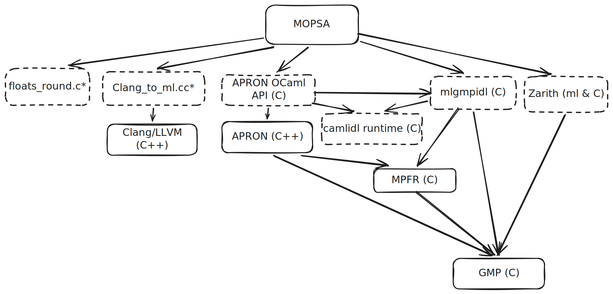

- https://mopsawasm.rboud.com/

MOPSA is a static analyzer based on abstract interpretation. It analyzes C and Python code, and it's written *mostly* in OCaml. That "mostly" is doing a lot of work, under the OCaml sits a stack of native libraries (GMP, MPFR, Zarith, Apron for the numerical domains, and LLVM/Clang to parse C) all bound to OCaml through its foreign function interface (FFI).

And I wanted to run it *100% client side in the browser*, no server. The analyzer itself compiled to WebAssembly.

This post is how I got there. OCaml has had workable wasm solutions for a while, like `wasm_of_ocaml`. The hard part is everything *around* the OCaml. The FFI goes both ways (OCaml calls into C/C++, and C/C++ build and read OCaml values directly). Getting that mix (`.ml` + `.c` + `.cc` + generated camlidl FFI stubs) to agree on what an OCaml value *is* on `wasm32` is where the real work lives.


## Why the hard part isn't OCaml at all



The diagram above shows every dependency that ships C or C++ code. The dashed ones use OCaml's FFI in one way or another. It's a bit of a mess, here are the spots worth paying particular attention to:

- `floats_round.c` is a MOPSA-internal file that implements floating-point arithmetic with control over the rounding mode, which is useful for interval analysis. To do that, it relies on `fesetround` (declared in `<fenv.h>`) to set the floating-point rounding mode. Except there's no equivalent in wasm, where everything is round-to-nearest, ties-to-even.
- `Clang_to_ml.cc` is a 5k-line MOPSA-internal file that bridges Clang and MOPSA. Its job is to take a C/C++ file, parse it with Clang, walk the AST Clang produces, and turn each node of that AST into an OCaml `value` the analyzer can then manipulate.
- `camlidl` is a stub generator between OCaml and C, used notably by Apron and mlgmpidl. Any code it generates uses the OCaml FFI, and on top of that depends on the *camlidl runtime*, a set of "utility" functions.

So a lot of the C/C++ here doesn't just compute and return, it allocates inside OCaml's heap and reads the tags and fields of OCaml blocks. Every one of those call sites bakes in an assumption about what an OCaml value is, byte for byte, in memory.


## The architectural bet: interpret the bytecode, don't recompile OCaml

First, why not `wasm_of_ocaml`, `js_of_ocaml`, or `wasocaml`? They all share the same blind spot: they compile the OCaml and leave the C/C++ behind. That's fine for a pure-OCaml project (or one whose few native dependencies already have a JS reimplementation, like `zarith_stubs_js`). But as far as I could tell, none of them offers a general escape hatch that *doesn't* require hand-writing glue to bridge wasm and JS. In my case that would mean rewriting `Clang_to_ml.cc` entirely in JavaScript, and then maintaining that rewrite.

What I wanted instead was:

- **As little code as possible**, so the result stays maintainable.
- **As few moving parts as possible.** Getting a module compiled by `wasm_of_ocaml` to talk to one compiled by `emscripten` would mean understanding, in depth, how each compiler lays out and manages memory, and then writing the plumbing to stitch the two together.

And there was a more concrete problem underneath all this: **what do I link the FFI stubs against?** The C/C++ files that use the OCaml FFI call into runtime functions (`caml_alloc`, `caml_callback`, …). If I only compile the OCaml *code*, those symbols simply don't exist, the stubs have nothing to link against.

After a lot of trial and error (much of it still visible in [this repo](https://github.com/rboudrouss/mopsa-wasm)), the answer turned out to be the **OCaml runtime itself**: it's the thing that "*provides*" an implementation of all those `caml_*` functions.

And that quietly solves every point at once. No more juggling several tools, I can lean on `emscripten` alone, because once I bring in the runtime I'm left with nothing but C and C++ to compile.

So the plan: compile the OCaml to bytecode, compile the OCaml runtime and all the native dependencies to wasm, link that native bundle together, then run the bytecode on top. And that should just work... right?

## How do I link everything

Before thinking about compilation (something Emscripten handles well enough), it's worth thinking about linking. The interpreter needs to find, at runtime, the C code behind each `external` declared in the bytecode. And there, **OCaml resolves its C primitives dynamically** via `dlopen` and `dlsym`.

### How it works, and why it breaks

When you write `external foo : int -> int = "caml_foo"`, the compiler never emits a direct call to `caml_foo`. It assigns it a **number** and emits a `C_CALLn <index>` instruction. The name-address binding is only resolved at program startup: OCaml `dlopen`s the native libraries and `dlsym`s each primitive by name to fill a table of function pointers. At runtime, `C_CALLn <index>` is just `caml_prim_table[index](args)`.

Emscripten does have a way to emulate dynamic module loading, but it's complex to set up and splits the binary into multiple wasm modules. Since keeping everything in a single static `.wasm` seemed simpler (and at 12 MB the result is still reasonable) I chose to short-circuit this mechanism entirely.

The OCaml runtime already has a static path for this. Before searching through `.so` files, `lookup_primitive` first checks a **static table** compiled into the runtime itself:

```c
static c_primitive lookup_primitive(char * name)
{
  /* 1. built-in table, statically linked */
  for (int i = 0; caml_names_of_builtin_cprim[i] != NULL; i++)
    if (strcmp(name, caml_names_of_builtin_cprim[i]) == 0)
      return caml_builtin_cprim[i];
  /* 2. only then, dynamically loaded .so files */
  for (int i = 0; i < shared_libs.size; i++) {
    void * res = caml_dlsym(shared_libs.contents[i], name);
    if (res != NULL) return (c_primitive) res;
  }
  return NULL;
}
```

These two arrays, `caml_builtin_cprim[]` (the pointers) and `caml_names_of_builtin_cprim[]` (the names), are exactly what `ocamlc -custom` produces, a generated file, conventionally called `prims.c`, that declares all the primitives of the executable and stores them in these two tables. This is OCaml's "fully static" mode, originally designed to produce executables with no dependency on `dll*.so` files.

So then I supply my own `prims.c` containing *all* the primitives the MOPSA bytecode needs, and I disable the `dlopen` branch in the runtime (which has nothing to load anyway). The patch is a few commented-out lines in `caml_build_primitive_table`:

```c
caml_ext_table_init(&shared_libs, 8);
// wasm: shared libraries are not supported, skip open_shared_lib
// if (libs != NULL)
//   for (p = libs; *p != 0; p += strlen_os(p) + 1)
//     open_shared_lib(p);
```

`shared_libs` (the runtime's internal list of `dlopen`ed `.so` files) stays empty permanently. The second loop in `lookup_primitive` never finds anything: **every primitive must be present in my built-in table**, or the runtime halts immediately with `unknown C primitive`.

### Building `prims.o`: extracting the primitives

The table must be a **superset** of everything the bytecode calls. I collect the primitives by scanning the C/C++ sources (both the runtime's and every library I link) with a small script, `extract-primitives.js`. It follows the same idea as OCaml's `gen_primitives.sh` (`sed -n 's/^CAMLprim value \(…\)/\1/p'`) but is more robust, because MOPSA's and Apron's sources don't always follow the `CAMLprim value foo(...)` convention.

The result, ~1435 primitives, is the union of several worlds: the runtime core (`caml_*`), `unix` (131 primitives), `str`, `bigarray`/`int64`, and the 655 Apron stubs generated by CamlIDL (`camlidl_*_ap_*`). I commit `primitives.txt` as-is; occasionally I cross-check it against `strings build/mopsa.bc` to verify it actually covers what the bytecode calls.

From that list, `prims.c` is generated with three `sed` passes in the Makefile:

```make
$(BUILD_DIR)/prims.o:
	(echo '#define CAML_INTERNALS'; \
	 echo '#include <caml/mlvalues.h>'; \
	 echo '#include <caml/prims.h>'; \
	 sed -e 's/.*/extern value &();/'        backend/wasm/primitives.txt; \
	 echo 'c_primitive caml_builtin_cprim[] = {'; \
	 sed -e 's/.*/\t&,/'                      backend/wasm/primitives.txt; \
	 echo '\t 0 };'; \
	 echo 'char * caml_names_of_builtin_cprim[] = {'; \
	 sed -e 's/.*/\t"&",/'                    backend/wasm/primitives.txt; \
	 echo '\t 0 };') > $(BUILD_DIR)/prims.c
	$(EMCC) $(EMCC_FLAGS) -Wno-incompatible-function-pointer-types \
	    -c -I $(OCAML_STDLIB) -o $(BUILD_DIR)/prims.o $(BUILD_DIR)/prims.c
```

The generated file looks like this:

```c
extern value caml_array_get();
extern value unix_read();
/* … 1435 lines … */

c_primitive caml_builtin_cprim[] = {
    caml_array_get, unix_read, /* … */ 0 };

char * caml_names_of_builtin_cprim[] = {
    "caml_array_get", "unix_read", /* … */ 0 };
```

Each primitive is declared `extern value foo();` with no argument prototype. Their actual signatures differ (arities 1 to 5, plus `N`), but that doesn't matter, the interpreter always recasts the pointer to the right arity at the call site (`Primitive1(n)`, `Primitive2(n)`, … in `prims.h`). Hence the `-Wno-incompatible-function-pointer-types` that silences the expected warning.

## Compiling the ocaml runtime (4.14.2)

Compiling the runtime is fairly straightforward, with one small catch. OCaml 4.14 introduced `runtime/sak`, a tool run on the host to encode the stdlib path as a C string literal. `emconfigure` compiles it with `emcc` and produces a `.wasm` binary that cannot be executed natively and the build continues silently, the path stays empty, and the failure only surfaces at runtime. The fix is to compile `sak` manually with the real `cc` before calling `make`.

```make
CFLAGS="$(CFLAGS)" $(EMCONFIGURE) ./configure \
    --disable-native-compiler \
    --disable-systhreads \
    --disable-ocamltest --disable-ocamldoc
rm -f runtime/sak runtime/sak.o runtime/sak.wasm
cc -c -o runtime/sak.o runtime/sak.c && cc -o runtime/sak runtime/sak.o
touch runtime/sak.o runtime/sak
CFLAGS="$(CFLAGS)" $(MAKE) -C runtime libcamlrun.a
```

The `runtime/` directory contains the `<caml/*.h>` headers that define OCaml's FFI API, the same headers every C stub compiled next depends on. Every subsequent compilation that touches the FFI passes `-I$(OCAML_STDLIB)`, pointing at that same `runtime/`. This guarantees that stubs are compiled against the exact definitions of the runtime that will execute them.

## Compiling MPFR & GMP

GMP and MPFR are the first two libraries to compile. Both build easily with Emscripten almost unchanged.

The pattern is the same for both: `emconfigure ./configure` followed by `make`. `emconfigure` rewrites the compiler environment variables (`CC`, `AR`, etc.) to point at the Emscripten toolchain, which is enough for the feature detection in `configure` to target wasm32 instead of the host.

```make
# GMP
CFLAGS="$(CFLAGS)" $(EMCONFIGURE) ./configure \
    --disable-assembly \
    --host=none \
    --prefix=$(INSTALL_DIR)
$(MAKE) && $(MAKE) install

# MPFR (depends on GMP)
touch aclocal.m4 configure
find . -name "Makefile.in" -exec touch {} \;
CFLAGS="$(CFLAGS)" $(EMCONFIGURE) ./configure \
    --with-gmp=$(INSTALL_DIR) \
    --host=none \
    --prefix=$(INSTALL_DIR)
$(MAKE) && $(MAKE) install
```

Two details worth noting.  
For GMP, `--disable-assembly` is mandatory: GMP normally uses architecture-specific assembly routines (x86, ARM...) for performance, and Emscripten cannot compile them. `--host=none` prevents `configure` from detecting and using host-specific optimizations.  
For MPFR, the `touch` on `aclocal.m4` and `configure` prevents `make` from trying to re-run autoconf to regenerate the `Makefile.in` files, which would fail inside the Emscripten environment.

The specific versions (GMP 6.1.2 and MPFR 4.2.2) are not arbitrary, they are the ones known to compile cleanly with Emscripten, identified in [a Stack Overflow answer](https://stackoverflow.com/a/43583154).


## Compiling CamlIDL based stubs

CamlIDL is a stub generator. You give it an `.idl` file describing a set of C types and functions, and it produces two things: `foo_stubs.c`, containing the C functions that convert OCaml values to and from C, and `foo.ml`/`foo.mli`, the OCaml API. The idea is to never write the conversion plumbing by hand.

Two of MOPSA's dependencies rely on this heavily: **mlgmpidl** (OCaml bindings for GMP and MPFR) and **mlapronidl** (OCaml bindings for Apron's abstract domains). Together they account for roughly 655 of the ~1435 primitives in the final table.

### CamlIDL runtime

`camlidl` runs at build time to generate the required `.ml` and `.c` files. Every generated file depends on the CamlIDL runtime which is a set of three files (`idlalloc.c`, `comintf.c`, and `comerror.c`) that provide utilities for the generated code, mainly memory allocation and interface helpers.

Here is the Makefile rule used to compile these files:

```make
$(LIBS_DIR)/libcamlidl.a:
    $(EMCC) $(EMCC_FLAGS) -D_FILE_OFFSET_BITS=64 -D_REENTRANT \
        -c -I$(OCAML_STDLIB) $(DEPS_DIR)/camlidl/runtime/idlalloc.c  -o $(BUILD_DIR)/idlalloc.o
    $(EMCC) $(EMCC_FLAGS) -D_FILE_OFFSET_BITS=64 -D_REENTRANT \
        -c -I$(OCAML_STDLIB) $(DEPS_DIR)/camlidl/runtime/comintf.c   -o $(BUILD_DIR)/comintf.o
    $(EMCC) $(EMCC_FLAGS) -D_FILE_OFFSET_BITS=64 -D_REENTRANT \
        -c -I$(OCAML_STDLIB) $(DEPS_DIR)/camlidl/runtime/comerror.c  -o $(BUILD_DIR)/comerror.o
    $(EMAR) rcs $(LIBS_DIR)/libcamlidl.a \
        $(BUILD_DIR)/idlalloc.o $(BUILD_DIR)/comintf.o $(BUILD_DIR)/comerror.o
```

Note the `-I$(OCAML_STDLIB)` flag that points at the OCaml FFI headers from the runtime we just compiled.

### mlgmpidl and mlapronidl

Both `mlgmpidl` (GMP/MPFR bindings) and `mlapronidl` (Apron abstract domain bindings) follow the same pattern: use the upstream `Makefile` to generate the CamlIDL stubs as `.c` files, then compile each one with `emcc`. For example, `mlapronidl`:

```make
$(MAKE) -C $(DEPS_DIR)/apron/mlapronidl CAMLIDL=$(CAMLIDL) PERL=$(PERL) $(MLAPRONIDL_IDL:%=%_caml.c)
for module in $(MLAPRONIDL_MODULES); do
    $(EMCC) $(EMCC_FLAGS) -c $(CAMLIDL_CFLAGS) \
        -I$(DEPS_DIR)/apron/apron -I$(DEPS_DIR)/apron/mlapronidl \
        -o $(BUILD_DIR)/$${module}.o $(DEPS_DIR)/apron/mlapronidl/$${module}.c
done
$(EMAR) rcs $@ $(addprefix $(BUILD_DIR)/,$(MLAPRONIDL_MODULES:%=%.o))
```

## Compiling APRON

Each numerical domain (box, octagons, polka) is compiled as its own archive, compiled with `-DNUM_MPQ`:

```make
$(EMCC) $(EMCC_FLAGS) -c $(CAMLIDL_CFLAGS) \
    -I$(DEPS_DIR)/apron/box -DNUM_MPQ \
    -o $(BUILD_DIR)/box_caml.o $(DEPS_DIR)/apron/box/box_caml.c
$(EMAR) rcs $(DEPS_BIN_DIR)/libboxMPQ_caml.a $(BUILD_DIR)/box_caml.o
```

`NUM_MPQ` tells Apron to use GMP's exact multi-precision rationals (`mpq_t`) instead of hardware `double` for all bounds. Apron's floating-point domains normally rely on `fesetround` to control hardware rounding direction, but WebAssembly has no FPU rounding mode control. With `NUM_MPQ`, every bound is computed exactly via GMP and `fesetround` is never needed.


## Compiling LLVM/Clang 9

A good chunk of LLVM is *generated* automatically by native tools (`llvm-tblgen` and `clang-tblgen`) that must run natively on the host machine.

### The two-stage build


**Stage 1: build the native tools.**

```make
cmake -G Ninja -S $(LLVM_WASM_SRC)/llvm -B $(LLVM_NATIVE_BUILD) \
  -DCMAKE_C_COMPILER=gcc-11 \
  -DCMAKE_CXX_COMPILER=g++-11 \
  -DLLVM_ENABLE_PROJECTS=clang \
  -DLLVM_TARGETS_TO_BUILD=host \
  -DCMAKE_BUILD_TYPE=Release \
  -DLLVM_BUILD_TOOLS=OFF \
  ...
ninja -C $(LLVM_NATIVE_BUILD) llvm-tblgen clang-tblgen
```

We build only `llvm-tblgen` and `clang-tblgen`, natively, with `gcc-11`. We use `gcc-11` because the LLVM 9 code is no longer compatible with recent versions of `gcc` and `clang`.

**Stage 2: build the wasm libraries**

```make
cmake -G Ninja -S $(LLVM_WASM_SRC)/llvm -B $(LLVM_WASM_BUILD) \
  -DCMAKE_TOOLCHAIN_FILE=$(EMSDK_TOOLCHAIN) \
  -DLLVM_TABLEGEN=$(LLVM_NATIVE_BUILD)/bin/llvm-tblgen \
  -DCLANG_TABLEGEN=$(LLVM_NATIVE_BUILD)/bin/clang-tblgen \
  -DLLVM_ENABLE_PROJECTS=clang \
  -DLLVM_TARGETS_TO_BUILD=WebAssembly \
  -DLLVM_DEFAULT_TARGET_TRIPLE=wasm32-unknown-emscripten \
  -DLLVM_HOST_TRIPLE=wasm32-unknown-emscripten \
  -DLLVM_ENABLE_THREADS=OFF \
  -DLLVM_ENABLE_ZLIB=OFF \
  -DLLVM_ENABLE_TERMINFO=OFF \
  -DLLVM_ENABLE_LIBEDIT=OFF \
  -DLLVM_ENABLE_LIBXML2=OFF \
  -DLLVM_ENABLE_ASSERTIONS=OFF \
  -DLLVM_ENABLE_EH=OFF \
  -DLLVM_ENABLE_RTTI=OFF \
  ...
```

The `-DLLVM_TABLEGEN` and `-DCLANG_TABLEGEN` flags point directly at the native tools we already built.

### The libraries we keep

We don't build all of LLVM.

```make
ninja -C $(LLVM_WASM_BUILD) \
  clangFrontend clangParse clangAST clangLex clangBasic \
  clangSema clangDriver clangEdit clangSerialization \
  clangAnalysis clangStaticAnalyzerCore \
  LLVMSupport LLVMCore LLVMMC LLVMMCParser \
  LLVMBinaryFormat LLVMBitReader LLVMBitstreamReader \
  LLVMOption LLVMProfileData LLVMDemangle LLVMRemarks
```

No code-generation backend (`LLVMX86*`, `LLVMAArch64*`, etc.), no optimizers (`LLVMTransformUtils`, `LLVMInstCombine`, etc.). We only want the parsing frontend (lexer, parser, AST, semantics) and the minimal LLVM support it requires.

And that's it, we have our LLVM compiled.

## Compiling `Clang_to_ml.cc`

`Clang_to_ml.cc` is the heart of MOPSA's C frontend. It's a ~5000-line file that does two things at once:

1. It drives Clang to parse a C file (via `CompilerInstance`, `ParseAST`, `RecursiveASTVisitor`).
2. It allocates OCaml values and fills them with data from the Clang AST.

What makes this file special is that it includes *both* Clang headers and OCaml runtime headers at the same time:

```cpp
// Clang headers
#include "clang/AST/RecursiveASTVisitor.h"
#include "clang/Frontend/CompilerInstance.h"
// ...

// OCaml headers
#include <caml/mlvalues.h>
#include <caml/alloc.h>
#include <caml/memory.h>
// ...
```

At each node of the Clang AST, the visitor creates a corresponding OCaml block with `caml_alloc`, stores fields into it with `Store_field`, and returns an OCaml `value` to the OCaml code that called into this C++. This is allocation inside the OCaml garbage collector's heap, from C++, using the `CAMLparam`/`CAMLlocal`/`CAMLreturn` macros that maintain the GC's invariants.

Compiling this file requires three sets of includes at once:

```make
em++ -std=c++14 \
  -I$(LLVM_WASM_SRC)/llvm/include \           # LLVM headers
  -I$(LLVM_WASM_SRC)/clang/include \          # Clang headers (sources)
  -I$(LLVM_WASM_BUILD)/include \              # TableGen-generated headers
  -I$(LLVM_WASM_BUILD)/tools/clang/include \  # generated Clang headers
  -I$(OCAML_STDLIB) \                         # <caml/*.h> from the OCaml runtime
  -DCLANGRESOURCE=\"/clang-headers\" \
  -fno-rtti -fno-exceptions \
  -c $(CLANG_TO_ML_SRC) -o $(BUILD_DIR)/clang_to_ml.o
```

The `-DCLANGRESOURCE="/clang-headers"` is explained right below.

### Clang's resource headers

To parse C, Clang needs its own built-in headers: `stddef.h`, `limits.h`, `__stddef_max_align_t.h`, etc. These are Clang-specific headers, distinct from the system headers, that define the fundamental types and macros in a portable way. On a normal Linux system, they live in `/usr/lib/clang/9.0.1/include/`.

In a wasm binary, there's no system filesystem. We preload them into Emscripten's virtual filesystem:

```make
ninja -C $(LLVM_WASM_BUILD) install-clang-resource-headers
# installs into $(INSTALL_DIR)/lib/clang/9.0.1/include/
```

And in the final link:
```make
--preload-file $(INSTALL_DIR)/lib/clang/9.0.1/include@/clang-headers/include
```

`Clang_to_ml.cc` is compiled with `-DCLANGRESOURCE="/clang-headers"`, which tells Clang where to look for these headers in the virtual FS. Without it, the first `#include <stddef.h>` in an analyzed C file fails with a header-not-found error in the browser.

## The final link: everything static

emscripten's final link pulls everything into a single `ocamlrun.wasm`:

```make
$(EMCC) ... -o $(DIST_DIR)/ocamlrun.js \
    --preload-file $(BUILD_DIR)/mopsa.bc@/build/mopsa.bc \
    $(LIBS_DIR)/*.a \
    -s ERROR_ON_UNDEFINED_SYMBOLS=1 \
    $(BUILD_DIR)/prims.o $(BUILD_DIR)/libcamlrun.a
```

Three things worth noting:

- **Everything is statically linked**: `libcamlrun.a` (the interpreter), `prims.o` (the primitive table), and all the `.a` archives (GMP, MPFR, Apron, the CamlIDL runtime, the OCaml Apron stubs (box/oct/polka), Zarith, Clang/LLVM, MOPSA's C parser, and my `libmopsa_primitives.a` (unix + str)). That's what yields a self-contained `.wasm` of ~15 MB.
- `ERROR_ON_UNDEFINED_SYMBOLS=1` guarantees that **every symbol named in `caml_builtin_cprim[]` actually exists** in one of the archives. If `primitives.txt` names a primitive that nothing provides, the wasm link fails loudly rather than hitting `unknown C primitive` at runtime, in the browser, at the worst possible moment.
- **`mopsa.bc` is not linked**, it is *preloaded* into emscripten's virtual filesystem, then interpreted at runtime by `ocamlrun`. It's bytecode, not native code.

We did everything right, yet at runtime in the browser we hit an "index out of bounds".

## OCaml values at the FFI boundary on wasm32

The "index out of bounds" leads us straight into OCaml's memory representation. An OCaml value is either *immediate* (an integer encoded directly in the word, with its low bit set to 1) or a boxed *block* (a pointer to a heap region preceded by a **header word**). That header, placed right *before* the pointer, encodes three fields: the **tag** (the low 8 bits, the block's constructor, or `Double_array_tag`, `String_tag`, etc.), the **wosize** (size in words) and the GC **color**.

```
        Header                  block data
   ┌──────────────────┐   ┌──────────┬──────────┬─────
   │ wosize| col | tag│   │ field 0  │ field 1  │ ...
   └──────────────────┘   └──────────┴──────────┴─────
          val[-1]              ▲ val points here
```

Tracing the "index out of bounds" back to the macro, we land on OCaml 4.14.2's form of `Tag_val`, in little-endian:

```c
#define Tag_val(val) (((unsigned char *) (val)) [-sizeof(value)])
```

My first thought was a bad compilation of `sizeof(value)` or a 64/32-bit mismatch. But `sizeof` is a compile-time constant, and it always evaluates to `4` here; the config is perfectly consistent under ILP32 (`SIZEOF_PTR == SIZEOF_LONG == 4`, and `ARCH_SIXTYFOUR` being undefined implies `intnat == value == header_t == uintnat == 4` bytes), and no build path ever switches to 64 bits. The hypothesis of a 64-bit `header_t` or a mis-evaluated `sizeof` is wrong.

The real problem is an **unsigned negation**. The type of `sizeof(value)` is `size_t`, *unsigned* (4 bytes on wasm32). So the negation never produces `-4`, it wraps around:

```
-sizeof(value) = -(size_t)4 = 0xFFFFFFFC   (unsigned wraparound, not -4!)
p[0xFFFFFFFC]  = *(p + 0xFFFFFFFC)
```

To see why the *same* expression behaves differently on x86 and on wasm, you have to follow it through the compiler. Clang doesn't emit a memory access directly: it first lowers `p[idx]` into a [`getelementptr`](https://llvm.org/docs/LangRef.html#getelementptr-instruction) (GEP) in LLVM IR (the instruction that computes `address = base + index × sizeof(element)`) and *then* the backend lowers that GEP, together with the load, into a native (or wasm) memory instruction. The C is identical on both targets, only this last lowering step differs.

**On native 32-bit**, the effective address lives in a 32-bit register, and `p + 0xFFFFFFFC` is a plain 32-bit `add`. The add overflows and the hardware silently truncates modulo 2³², so the result is *exactly* `p - 4`. It is technically overflowing, but it "works" by wraparound, which is why upstream OCaml gets away with it on every 32-bit native platform.

**On wasm32**, addresses are also `i32`, so you might expect the same wrap. But wasm offers two ways to add an offset, and they don't behave the same:

- an explicit `i32.add`, which *does* wrap modulo 2³², this would have given `p - 4` and worked.
- the **static offset baked into the memory instruction** (`i32.load offset=N`), where the runtime computes the effective address as `ea = base + N` and bounds-checks `ea + access_size` against the linear-memory size. That comparison is done on the full, untruncated value and it does **not** wrap modulo 2³².

Because `0xFFFFFFFC` is a compile-time constant, LLVM does the natural optimization and folds it into the load's static offset rather than emitting a separate `i32.add`. So instead of computing `p - 4`, the runtime checks:

```
ea = p + 0xFFFFFFFC   ~ 4 GiB, no wraparound
ea + 1 > memory_size  -> trap -> out of bounds
```

That trap *is* the "index out of bounds" we saw. The unsigned `0xFFFFFFFC` survives as a near-4 GiB constant offset that the wasm bounds check rejects.

So we apply this fix to avoid any unsigned negation:

```c
#define Hd_val(val)      (*((uint32_t *)(val) - 1))
#define Tag_val(val)     ((tag_t)(Hd_val(val) & 0xFF))
#define Tag_set(val, t)  (Hd_val(val) = (Hd_val(val) & ~(uint32_t)0xFF) | (uint32_t)(tag_t)(t))
```

In `(uint32_t *)val - 1`, the `- 1` is a *signed* integer applied to a typed pointer, with no unsigned negation. `Tag_val` is no longer an l-value (you can't write through it anymore), so I added `Tag_set`, which rewrites *only* the tag byte while preserving the wosize and the color. The few sites that wrote the tag via `Tag_val(...) = ...` were migrated to `Tag_set`.


## D'un `.wasm` à une vraie app

À ce stade j'ai un `ocamlrun.wasm` de 15 Mo qui sait interpréter `mopsa.bc`. Mais un `.wasm` n'est pas une application : il faut l'instancier, lui donner des fichiers à analyser, récupérer sa sortie, et pour les modes interactif et debugger, lui *parler pendant qu'il tourne*.

### Une instance neuve par analyse

Le premier réflexe serait d'instancier le `.wasm` une fois et de relancer une analyse à chaque fois que l'utilisateur édite son code. Mais ça ne marche pas car le runtime OCaml n'est pas réentrant. Il s'appuie sur tout un état global (le tas du GC, la table des primitives, les variables globales du bytecode), et `mopsa.bc` se termine par un `exit`. Une fois `main` sorti, l'instance est dans un état dont on ne sait pas revenir proprement.


Une solution aurait été de garder une seule instance et d'utiliser **Asyncify** pour suspendre/reprendre le runtime autour des entrées-sorties. Mais Asyncify est incompatible avec le mécanisme d'exceptions d'OCaml, qui repose sur `setjmp`/`longjmp`, les deux se disputent le contrôle de la pile et se marchent dessus.

J'ai donc choisi de **repartir d'une instance neuve à chaque analyse**. Côté Emscripten, ça se traduit par `MODULARIZE=1` plus un `EXPORT_NAME` :

```make
-s MODULARIZE=1 \
-s EXPORT_NAME='createMopsaModule' \
```

Au lieu d'instancier le module au chargement, Emscripten expose une *factory* `createMopsaModule(config)` qui renvoie une `Promise` vers une instance fraîche, configurable au cas par cas. Chaque analyse appelle `createMopsaModule(...)`, laisse tourner `main`, récupère la sortie, puis jette l'instance.

### Le système de fichiers virtuel

MOPSA est un outil en ligne de commande : il lit des fichiers, une config, des stubs. Dans le navigateur il n'y a pas de système de fichiers, donc on s'appuie sur le **FS virtuel d'Emscripten**. Deux moitiés :

- **Le statique, préchargé.** Tout ce qui ne change jamais d'une analyse à l'autre est empaqueté dans `ocamlrun.data` (~21 Mo) au moment du lien, via `--preload-file` :

  ```make
  --preload-file $(BUILD_DIR)/mopsa.bc@/build/mopsa.bc \
  --preload-file $(INSTALL_DIR)/lib/clang/9.0.1/include@/clang-headers/include \
  --preload-file $(LINUX32_INCLUDE_DIR)@/usr/include \
  --preload-file $(DEPS_DIR)/mopsa-analyzer/share/mopsa@/share/mopsa \
  ```

  Le bytecode `mopsa.bc`, les headers built-in de Clang, les headers système linux32 nécessaire pour analyser du C avec MOPSA, et `share/mopsa` (les configs et les stubs C/Python) atterrissent à des chemins fixes dans le FS virtuel.

- **Le dynamique, écrit à la volée.** Le code de l'utilisateur, sa config, ses fichiers supplémentaires sont écrits juste avant le lancement, dans un hook `preRun`. Pour ça j'exporte `FS` (écrire les fichiers) et `ENV` (positionner des variables d'environnement) :

  ```make
  -s EXPORTED_RUNTIME_METHODS="['FS','ENV']" \
  ```

  ```js
  function makePreRun(code, config, codeFile, extraFiles) {
    return function (M) {
      if (M.ENV) M.ENV.TERM = "xterm-256color";
      M.FS.writeFile("/config.json", config);
      // ... mkdirTree + writeFile pour chaque fichier supplémentaire ...
      // Le fichier de code est écrit EN DERNIER pour écraser toute entrée périmée.
      M.FS.writeFile(codeFile, code);
    };
  }
  ```

  Le `TERM = "xterm-256color"` permet a MOPSA de d'émettre des couleurs ANSI dans ces sorties qu'on gère ensuite avec `xterm.js`.

### Le runner : `mopsa_worker.ml`

Le point d'entrée du bytecode n'est pas le `main` de MOPSA, mais un petit fichier maison, `mopsa_worker.ml`, compilé en bytecode (`modes byte`, `-linkall`, `-no-check-prims`). Son rôle est de préparer `Sys.argv` *avant* de déléguer à `Mopsa_analyzer.Framework.Runner`.

C'est notamment utile pour l'analyse **multilangage C + Python** où MOPSA, notamment quand il y a plusieus fichier C, qu'on ait généré au préalable une *"buid DB"* (`mopsa.db`). Je fabrique manuellement cette db avec tout les fichiers C :

```ocaml
(* Multilangage : générer mopsa.db depuis les fichiers C, ne passer que le .py d'entrée. *)
let db_path = Filename.concat workdir "mopsa.db" in
generate_db db_path c_files;
let new_argv = Array.of_list (prog :: other_args @ [entry_py]) in
```

`mopsa_worker.ml` sépare donc `argv` en trois (flags, fichiers `.c/.h`, fichiers `.py`), et s'il y a *à la fois* du C et du Python, il génère un `mopsa.db` en mémoire avec `Mopsa_build_db`, le pose dans le répertoire de travail, et ne passe que le point d'entrée Python à l'analyseur. C'est ce qui rend l'analyse cross-C/Python possible côté client (j'y reviens plus bas).

Côté JS, la fonction `buildArgs` complète la ligne de commande avec les chemins du FS virtuel :

```js
function buildArgs(options, isHelp) {
  return ["build/mopsa.bc"]
    .concat(isHelp ? [] : ["-config", "/config.json"])
    .concat(["-share-dir", "/share/mopsa", "-I", "/clang-headers", "-I", "/usr/include"])
    .concat(options || []);
}
```

### L'API : `window.mopsaJs`

Tout passe par un objet global, `window.mopsaJs`, installé par `mopsa_api.js`, un script **synchrone, chargé avant le bundle React**, de sorte que l'API est prête instantanément quand React démarre.

Tout l'état du code et géré et garder dans le thread js principal, et je ne fais appel au wasm que pour l'analyse.

Tous les helpers de « système de fichiers » (`writeFile`, `readFile`, `listDir`, `deleteFile`, …) sont adossés à ces objets JS. Éditer du code, changer de fichier, naviguer dans l'arborescence : tout ça est synchrone et instantané, sans jamais toucher au WASM. Le `.wasm` n'entre en scène que quand on appelle `analyze()`.

De plus, **c'est le Worker qui possède le binaire**. Le `.wasm` (15 Mo) et le `.data` (~21 Mo) sont lourds, on ne veut ni les charger dans le thread principal, ni bloquer l'UI pendant une analyse qui peut durer assez longtemps. `analyze()` se contente d'envoyer l'état courant au Worker et de renvoyer une `Promise` résolue à la réponse :

```js
analyze: function (options) {
  // ... (voir plus bas pour l'annulation des analyses en vol) ...
  return new Promise(function (resolve) {
    var id = _nextId++;
    _pending[id] = resolve;
    _worker.postMessage({
      type: "analyze", id: id, options: options || [],
      code: _code, config: _config, codeFile: _codeFile, extraFiles: _extraFiles,
    });
  });
},
```

### Le Worker et le coût d'une instance

`mopsa_worker.js` récupère le `.wasm` et le `.data` **une seule fois** au démarrage. Le `.wasm` est compilé en amont en un `WebAssembly.Module` (via `compileStreaming`), et le `.data` est gardé comme `ArrayBuffer` :

```js
var _wasmModulePromise = WebAssembly.compileStreaming(fetch("./ocamlrun.wasm"));
var _dataBufferPromise = fetch("./ocamlrun.data").then(r => r.arrayBuffer());
```

À chaque analyse, on ré-*instancie* ce module déjà compilé (rapide, aucun réseau) plutôt que de tout recharger. Deux hooks d'Emscripten permettent de réutiliser ces ressources préchargées :

```js
moduleConfig.instantiateWasm = function (imports, successCallback) {
  WebAssembly.instantiate(wasmModule, imports)
    .then((instance) => successCallback(instance, wasmModule));
  return {};
};
moduleConfig.getPreloadedPackage = function () { return dataBuffer; };
```

C'est ce qui rend « une instance neuve par analyse » abordable : on paie la compilation et le fetch une fois, et chaque run ne paie que l'instanciation. La sortie est capturée via les callbacks `print`/`printErr` ; le `exit` d'OCaml se manifeste comme une exception `ExitStatus` qu'on reconnaît à son champ `status` et qu'on traite comme une fin normale.

### Le mode interactif et DAP

Le mode "batch" est un simple aller-retour. Mais MOPSA a aussi un mode **interactif** (un REPL où l'on avance pas à pas dans l'analyse) et un mode **DAP** (Debug Adapter Protocole). Ces deux modes sont un seul run, long, qui lit son stdin et se *bloque* en attendant qu'on lui réponde.

Or le Worker exécute le WASM de façon synchrone : quand MOPSA lit stdin, le thread du Worker est *gelé* à l'intérieur de la lecture. Il ne peut pas traiter un `postMessage` qui arriverait entre-temps. Il faut donc un **stdin synchrone** : un canal d'où le Worker peut tirer un octet de façon bloquante, pendant que le thread principal y écrit de façon asynchrone.

#### `SharedArrayBuffer` + `Atomics.wait`

La seule primitive du web qui permet ça est le couple `SharedArrayBuffer` / `Atomics.wait`. Le Worker se bloque sur `Atomics.wait` jusqu'à ce que le thread principal écrive un message dans la mémoire partagée et le réveille. J'utilise pour ça la petite lib [`sync-message`](https://github.com/alexmojaki/sync-message) (vendorisée), qui encapsule ce protocole derrière `makeChannel` / `writeMessage` / `readMessage`.

`SharedArrayBuffer` n'est accessible que si la page est **cross-origin isolated**, ce qui impose deux en-têtes HTTP :

```
Cross-Origin-Opener-Policy: same-origin
Cross-Origin-Embedder-Policy: require-corp
```

#### Brancher un stdin bloquant sur Emscripten

Emscripten lit stdin via un *char device* dont la fonction de lecture est appelée **octet par octet**, en boucle, jusqu'à ce qu'elle renvoie `null` (ce qui fait retourner le `read()` courant). Il faut donc rendre un octet à la fois, *et* renvoyer `null` à la fin de chaque ligne pour débloquer `read()` — sinon il attendrait une deuxième ligne que l'utilisateur n'a pas encore tapée. Un drapeau `delivering` distingue « je viens de finir un morceau » (renvoyer `null`, ne pas bloquer) de « début d'une lecture fraîche » (bloquer pour le prochain message) :

```js
return function () {
  if (pos < buf.length) { delivering = true; return buf[pos++]; }
  if (eof) return null;                 // EOF permanent
  if (delivering) { delivering = false; return null; }  // fin du morceau
  flushOut();                           // ← voir juste en dessous
  while (true) {
    var m = self.syncMessage.readMessage(channel, String(msgId++), {}); // bloque ici
    if (m == null) continue;
    if (m.eof) { eof = true; return null; }
    buf = encoder.encode(m.data || ""); pos = 0;
    if (buf.length === 0) continue;
    delivering = true; return buf[pos++];
  }
};
```

Le `flushOut()` juste avant de bloquer est subtil et m'a coûté du temps. Pendant que le thread est dans `Atomics.wait`, **les microtâches ne tournent pas**. Or la sortie est envoyée au thread principal via une microtâche. Le prompt `mopsa >> ` (sans saut de ligne, écrit juste avant la lecture) resterait donc coincé dans le tampon : l'utilisateur verrait un terminal figé, sans prompt, en attente d'une entrée invisible. On *flushe synchroniquement* la sortie juste avant de se bloquer.

Côté sortie justement, un `byte sink` collecte les octets de stdout/stderr et les `postMessage` vers le thread principal (en *transferable*, pour éviter une copie). Il batche normalement via une microtâche, mais expose aussi ce `flush()` synchrone que la lecture appelle avant de bloquer. Le même sink sert aux deux modes : l'interactif envoie les octets bruts à `xterm`, le DAP les réassemble en trames `Content-Length`.

#### Tuer une session

Un Worker bloqué dans `Atomics.wait` **ignore les `postMessage`** — on ne peut donc pas lui demander poliment de s'arrêter. Le seul interrupteur fiable est, là encore, `worker.terminate()` + respawn. C'est ce que fait `kill()`, et c'est aussi ce qui se déclenche sur Ctrl-C dans le terminal interactif.

### Le mode interactif côté UI

Dans le WASM, stdin est un char device **non-tty** : `tcgetattr` échoue, et MOPSA retombe sur un `Stdlib.read_line` ligne par ligne, **sans écho**. Si on se contentait de relayer les frappes, l'utilisateur ne verrait rien de ce qu'il tape.

Le terminal fait donc **l'écho local et l'édition de ligne minimale lui-même**, puis envoie la ligne entière (plus `"\n"`) à stdin sur Entrée :

```js
for (const ch of data) {
  if (ch === "\r" || ch === "\n") {
    term.write("\r\n");
    session.sendInput(lineRef.current + "\n");
    lineRef.current = "";
  } else if (ch === "\x7f" || ch === "\b") {  // backspace
    // ... effacer un caractère ...
  } else if (ch === "\x03") {                 // Ctrl-C → tuer le run
    kill();
  } else if (ch === "\x04") {                 // Ctrl-D → EOF
    session.sendEof();
  } else if (code >= 0x20) {                  // caractère imprimable → écho
    lineRef.current += ch; term.write(ch);
  }
}
```

La sortie du moteur (prompts, résultats, couleurs ANSI) arrive en octets bruts et est écrite telle quelle dans `xterm.js`, qui rend la palette 256 couleurs nativement.

### Le mode DAP côté UI

Le mode DAP est le plus exigeant : il faut parler un vrai protocole par-dessus le canal stdin/stdout. Un `DapClient` s'en charge.

**Trame.** Chaque requête est encadrée à la mode Language Server : `Content-Length: N\r\n\r\n<json>`, poussée vers stdin. Le flux d'octets de stdout est, en sens inverse, réassemblé en trames : on cherche le `\r\n\r\n`, on lit `N` octets de corps, on parse le JSON.

**Corrélation.** Normalement on apparie réponse et requête par le champ `seq`. Mais l'implémentation DAP de MOPSA écrit toujours `seq: 0` ; on corrèle donc sur `request_seq`, et le client maintient sa propre numérotation croissante.

**Sérialisation des requêtes.** C'est la contrainte la plus sournoise, et elle vient directement du choix du canal : **le canal stdin sur `SharedArrayBuffer` n'a qu'un seul créneau**. Un deuxième `writeMessage` avant que le Worker ait consommé le premier l'écraserait. Le client sérialise donc les requêtes derrière une file de promesses : la suivante n'est écrite qu'une fois la précédente résolue.

```js
sendRequest(command, args) {
  const fire = () => this.fire(command, args);
  const result = this.queue.then(fire, fire);
  this.queue = result.then(() => undefined, () => undefined);
  return result;
}
```

**Poignée de main.** Le démarrage suit la chorégraphie DAP standard : `initialize`, on attend l'événement `initialized`, puis on pose les points d'arrêt (`setBreakpoints`, `setExceptionBreakpoints`) et on lance (`launch`). Le moteur émet alors un événement `stopped` au point d'entrée, et le hook React rafraîchit la pile d'appels, les scopes et les variables. Les `continue` / `next` / `stepIn` / `stepOut`, l'évaluation d'expressions dans la watch, tout passe par les mêmes requêtes sérialisées..

## A few soundness adjustments for wasm

The `.wasm` loads, the runtime runs, the analysis terminates. What was left was a series of small assumptions, scattered across the native dependencies, that no longer hold once you're on wasm32 and that, if left alone, silently compromise the *soundness* of the analysis rather than crashing it.

The first we've already met: on wasm everything is *round-to-nearest, ties-to-even*, with no `fesetround` to control the direction. Since the error of a round-to-nearest is bounded by 0.5 ULP (*Unit in the Last Place* — the gap between two consecutive representable floats, i.e. the weight of the last mantissa bit at that magnitude), it's enough to inflate every computed bound by 1 ULP outward (`nextafter` toward `+∞` for upper bounds, toward `-∞` for lower ones) to recover a correct enclosure. This lives in MOPSA's `floats_round.c`, behind an `#ifdef __EMSCRIPTEN__` branch, and the inflation is adaptive: if the `double` actually fits in a `float`, it inflates by one *float* ULP (`nextafterf`, ~1e-7) rather than one *double* ULP (~2e-16), to avoid needlessly widening single-precision intervals.

<!-- The same file requires `FLT_EVAL_METHOD == 0`, i.e. that `double`s really are computed at `double` precision. But the 32-bit bytecode build goes through i386, where the historical x87 FPU evaluates in extended precision (`FLT_EVAL_METHOD == 2`). The workaround, in `docker/build-mopsa-32bc.sh`: `-mfpmath=sse -msse2`, which forces floating-point arithmetic onto the SSE2 registers and brings `FLT_EVAL_METHOD` back to `0`, the behavior MOPSA expects. -->

Apron, for its part, calls `ap_fpu_init` at startup, which probes the FPU via `fesetround(FE_UPWARD)`. On wasm that probe necessarily fails. We short-circuit the function at link time with `-Wl,--wrap=ap_fpu_init`, and our override in `backend/wasm/ap_fpu_wasm.c` (`__wrap_ap_fpu_init`) simply returns `true`. It's harmless here because everything is compiled with `NUM_MPQ`, so all bound arithmetic goes through GMP's exact rationals, never the FPU.

Finally, a subtler case on the C frontend side. MOPSA's parser runs in two stages: `Clang_to_ml.cc` walks the Clang AST and mirrors each node into an OCaml `value`, then `Clang_to_C.ml` translates that raw Clang AST into MOPSA's own internal C AST (`T_pointer`, `T_record`, …). This case lives in the second stage.

The trigger is `va_list`, whose shape depends on the target. On x86-64 it's an array (`__va_list_tag[1]`) that decays to a pointer — already handled by a helper, `fix_va_list`, that recognizes the `__va_list_tag *` pattern and folds it back to the `va_list` typedef. But on 32-bit targets (i386/wasm32) `va_list` is a plain scalar (`void*`), and `__builtin_va_start` takes its argument *by reference*, so the type now arrives as an `LValueReferenceType`. `Clang_to_C.ml` had no case for reference types and fell straight through to its catch-all:

```ocaml
| _ -> error range "unhandled type" (C.string_of_type t)
```

which aborts with `unhandled type: lvalue_ref(__builtin_va_list=void*)`. That blocked parsing of the CPython stub (`share/mopsa/stubs/cpython/Python.c`, `PyErr_Format`'s `va_start`) and therefore all cross C/Python analysis on 32-bit. Since a reference is ABI-equivalent to a pointer, the fix is just to model it as one, right before the catch-all:

```ocaml
(* References are ABI-equivalent to pointers; model them as such. These
   surface in C code via builtins such as __builtin_va_start, whose va_list
   argument is passed by reference when va_list is a scalar (a void
   pointer) on 32-bit targets, unlike x86-64 where it is an array that
   decays to a pointer (see fix_va_list above). *)
| C.LValueReferenceType tq -> T_pointer (type_qual range tq), no_qual
| C.RValueReferenceType tq -> T_pointer (type_qual range tq), no_qual
```

## 11. Wrap-up

- Perf profile (Clang parsing dominates), size (~15 MB), what this demonstrates.
- Honesty about the "first" claim → a *Prior art* sidebar (see note below).
- Outlook: upstream the OCaml patches?

---

## Remerciements

Le port OCaml → WASM repose sur le travail de [Vincent Chan](https://github.com/okcdz) sur [`ocaml-wasm`](https://github.com/vincentdchan/ocaml) (août 2021), qui a fourni les tweaks `configure` originaux et les stubs Unix (`unix_lib.c`, `socketaddr.c`, `unixsupport.c`, …) nécessaires pour faire tourner le runtime OCaml sous emscripten.

Pour la compilation LLVM/Clang vers wasm, [le fork de Binji](https://github.com/binji/llvm-project) et [ses notes](https://gist.github.com/binji/b7541f9740c21d7c6dac95cbc9ea6fca) ont été essentiels pour comprendre comment s'y prendre.

Les versions spécifiques de GMP et MPFR compatibles avec emscripten ont été trouvées grâce à [cette réponse Stack Overflow](https://stackoverflow.com/a/43583154).
